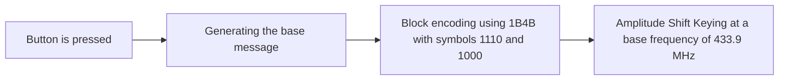

# SDR Decode 

## what is needed 

### subject ([LUM-LT-RF-RGBW-01](https://shop.gsmet.be/Article/ArticleDetails/a050e3fa-6031-46fb-9c97-5524d6bc4817))
The target device is a **LED controller** that operates with an RF remote. The goal is to capture the communication between the remote and the controller and decode it as much as possible.  
The datasheet specifies that it uses the **433.92 MHz** frequency band.
### SDR ([RTL SDR](https://www.hfelectronics.be/shop/scanners/600-rtl-sdr.html))
A **low-cost USB stick SDR** is being used, which costs around €25 and supports the required frequency range.  
If the target operates on a higher or lower frequency, ensure the SDR can handle that range.

### SDR software ([SDR#](https://airspy.com/download/))
For software, I opted for **SDR# (SDRSharp)**

## Capturing

To capture the signals, I used **SDR#** and configured it to record in **RAW** mode to avoid performing an analog-to-digital conversion prematurely. Next, I set SDR# to record at **433.9 MHz** with the following parameters:  

- **Filter Type**: Blackman-Harris 4  
- **Bandwidth**: 15 MHz  
- **Order**: 1.00  
- **Gain**: 0 dB  

I then used the built-in audio recording tool in **SDR#**, named **Audio: Simple Recorder**, to capture the signals. I recorded all button presses together in a single fragment while also capturing each action separately for easier analysis.

## Decoding 
###  Analog to digital 


```
100011101000100011101110111011101000100010001000111011101000111011101000100010001000100010001000100010001000
```

#### Method one

It looks like there are two symbols: `1000` and `1110`. When converting `1000` into `A` and `1110` into `B`, it transforms into this:

```
ABAABBBBAAAABBABBAAAAAAAAAA
```
Splitting it further into bytes gives (two to 5 symbols to short):
```
ABAABBBB AAAABBAB BAAAAAAA AAA
```

#### Method two

If you replace it with `00` = A, `01` = B, `10` = C, and `11` = D, you get:
``` 
CADCCACADCDCDCDCCACACACADCDCCADCDCCACACACACACACACACACA
```
Splitting it further into bytes results in (two to 2 symbols to short):
``` 
CADCCACA DCDCDCDC CACACACA DCDCCADC DCCACACA CACACACA CACACA
```

This seems more promising. However, there may have been a few `00` pairs discarded due to lack of context. It's also unclear where zeros were missed at the front or back of the sequence.

### Identifying Patterns in Signals

When using the first method for additional button presses, a pattern becomes clear. By correlating signal changes with the action performed, the following table summarizes the discovered relationships:

|                                        | START FLAG | ID       | CHANNEL | CMD  | DATA     |
| -------------------------------------- | ---------- | -------- | ------- | ---- | -------- |
| **Button 1 ON**                        | ABA        | ABBBBAAA | AAAB    | BBAA | AAAAAAAB |
| **Button 1 OFF**                       | ABA        | ABBBBAAA | AAAA    | BBAA | AAAAAAAA |
| **Button 2 ON**                        | ABA        | ABBBBAAA | AABA    | BABB | AAAAAAAB |
| **Button 2 OFF**                       | ABA        | ABBBBAAA | AAAA    | BABB | AAAAAAAA |
| **Button 3 ON**                        | ABA        | ABBBBAAA | ABAA    | BABA | AAAAAAAB |
| **Button 3 OFF**                       | ABA        | ABBBBAAA | AAAA    | BABA | AAAAAAAA |
| **Button 4 ON**                        | ABA        | ABBBBAAA | BAAA    | BAAB | AAAAAAAB |
| **Button 4 OFF**                       | ABA        | ABBBBAAA | AAAA    | BAAB | AAAAAAAA |
| **ALL Buttons (Pressing W)**           | ABA        | ABBBBAAA | BBBB    | ABAB | BBBBBBBB |
| **ALL Buttons (Trying pressing RED)**  | ABA        | ABBBBAAA | BBBB    | AAAA | ABBBBBAB |
| **ALL Buttons (Trying pressing BLUE)** | ABA        | ABBBBAAA | BBBB    | AAAA | ABABABBB |

> Note: When holding the button, the signal repeats, but instead of ABA, it starts with AABA. This appears to act as a flag to indicate that the signal has already been received, preventing repeated activation.

## Result

As seen above, this decoding process has been relatively successful. However, there are still some small details we may never fully understand. For example:

- **What `A` and `B` Represent**:  
  My assumption is that `A = 0` and `B = 1`, as it makes sense to assign the active-high channels to `1` in a program. However, without access to the firmware, this cannot be definitively confirmed.

- **Data Interpretation**:  
  While the data for the ON and OFF states seems clear, the binary data for colors doesn't make immediate sense. This inconsistency is annoying and suggests further investigation is required.

### Key Findings

Despite these uncertainties, we can conclude the following about the device's operation:


