# Data and Signals

## Digital signals

Digital signals are being represented by multiple analog sine waves

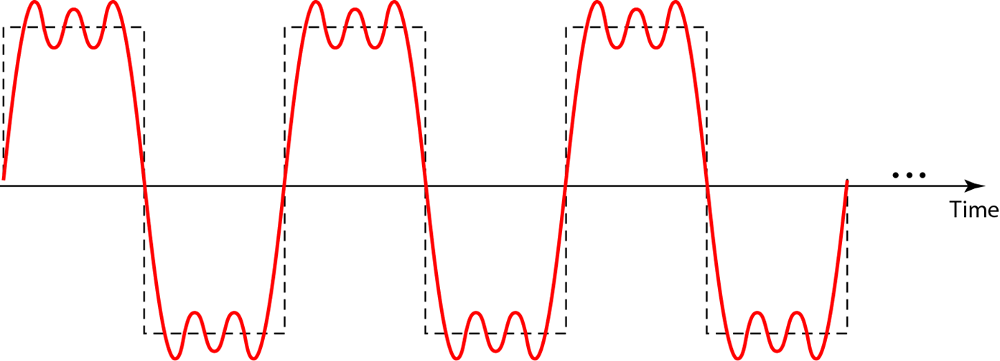

### Bandwith of a dedicated medium 

the Bandwidth of a medium acts like a band-pass filter letting on certain frequencies through. this means that our perfect digital signal that consist of infitante sine waves is now only letting throught the sine wave that are located in the bandwidth/bandpass-filter. 

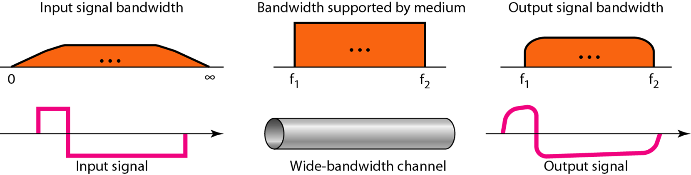

###  worst case scenario 

in the worst case scenario your medium only lets you send one sine wave without any harmonics. this can be described as: 
```math
\text{Frequency} = \text{Data Rate} / 2
```

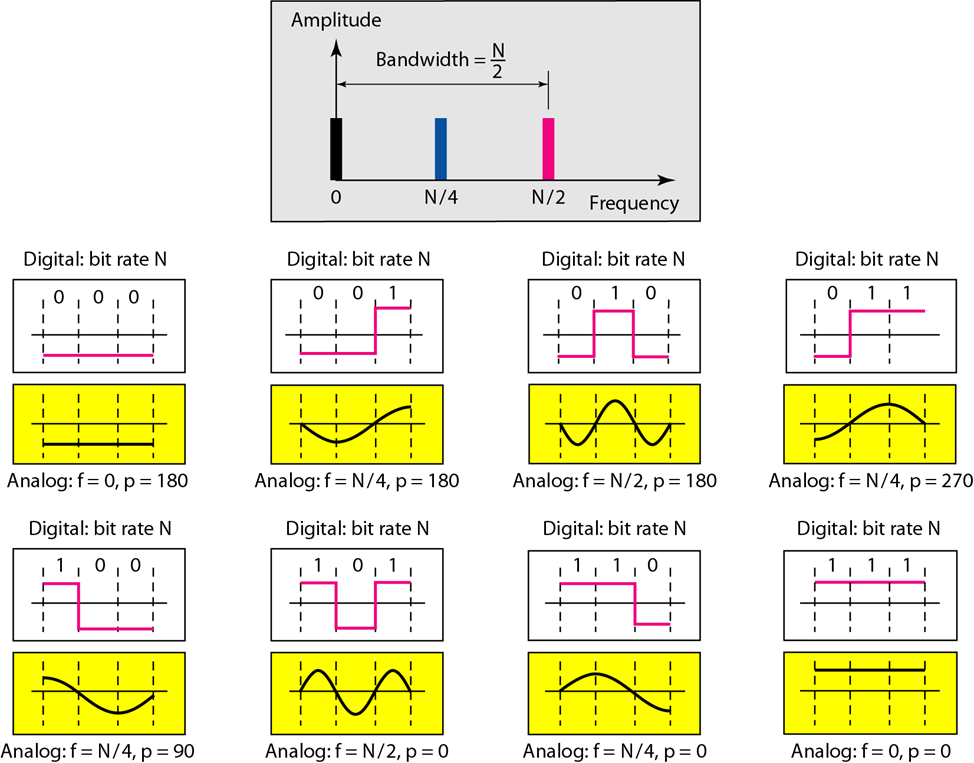

## Transmission impairment

### Attenuation (Loss of signal)
When a signal travels through a medium it loses energy overcoming the resistance of the medium
Amplifiers are used to compensate for this loss of energy by amplifying the signal.

### Distortion (Change in signal shape)
Distortion occurs in `composite` signals.
Each frequency component has its own propagation speed  -> don't arrive at the same time so some parts of the signal have a phase shift.

### Noise
- **thermal** : `electrons make noise by moving more heat more moving`
- **Induced** :`From spools (induction) that are active in the system`
- **Crosstalk** : `From signals through wires` 
- **Impulse** : `Voltage spikes in powerplanes (Lightning, power lines)`

## Data Rate

### Nyquist Theorem
Nyquist gives the upper bound for the bit rate of a transmission for a noiseless channel

```math
C = 2*\text{Bandwidth}*\log_2(2n)
```

### Shannon’s Theorem
Shannon’s theorem gives the capacity of a system in the presence of noise.

```math
C = \text{Bandwidth} * \log_2(1 + \text{SNR})
```

## Performance

- **Bandwidth** : `(Frames per minute * frame size)/60`

- **Propagation Delay** : `Distance/Propagation speed`

- **Transmission Delay **: `Message size/bandwidth bps`

- **Latency**: `Propagation delay + Transmission delay + Queueing time + Processing time`

# Digital Transmission

## Digital to Digital Conversion

We can represent digital data by using digital signals. The conversion involves three techniques: `line coding`, `block coding`, and `scrambling`. While `line coding` is always needed the others aren't needed but can be applied

## Line Coding  

Line encoding addresses several key problems:  
- **Baseline wandering**: A voltage offset in the baseline caused by long runs of 0s or 1s.  
- **DC components**: Most mediums are band-pass, so low frequencies (long runs of 0s or 1s) are filtered out.  
- **Self-synchronization**: Misalignment of sender and receiver clocks, leading to errors.  
- **Error detection**: Errors that occur during transmission due to line impairments.  
- **Noise and interference**: Some encoding techniques make the signal more resistant to noise and interference.  
- **Complexity**: More robust and resilient encoding methods are often more complex to implement, impacting baud rate or required bandwidth.  

There are many different line encoding methods, each addressing these problems in unique ways.  
### Unipolar NRZ-L  
This is the encoding we are most familiar with, as it is used in SPI, UART, and I2C.  

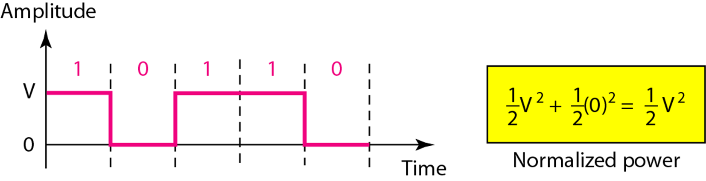  

### Polar NRZ-L & NRZ-I  
NRZ stands for Non-Return-to-Zero.  
- **NRZ-L**: The signal level changes based on the bit value (e.g., 0 = low, 1 = high).  
- **NRZ-I**: The signal inverts when the bit value is 1 and remains unchanged for 0.  

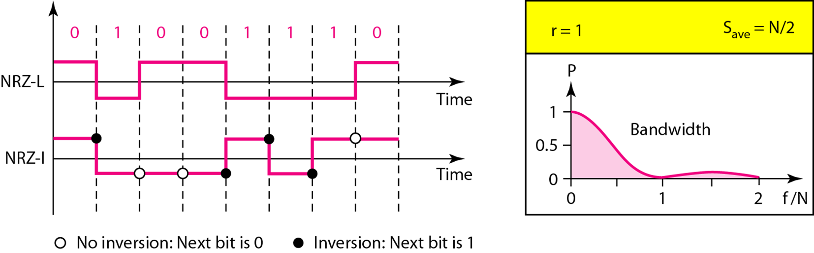  

### Polar RZ  

RZ stands for Return to Zero

This encoding method ensures that the signal returns to zero between each bit.  

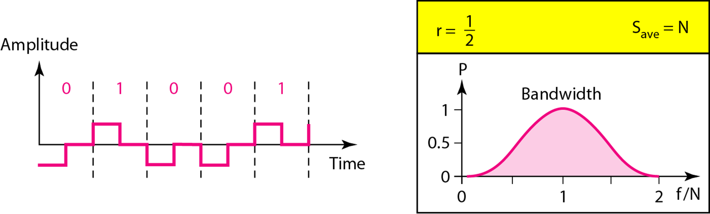  

### Manchester & Differential Manchester  

Manchester encoding ensures synchronization by encoding data bits based on transitions:  
- **Manchester**: A 0 is represented by a high-to-low transition, and a 1 by a low-to-high transition in the middle of the bit period.  
- **Differential Manchester**: Similar to NRZ-I, it changes transitions only when the data bit is 1. A transition always occurs at the start of the bit period for clock synchronization.

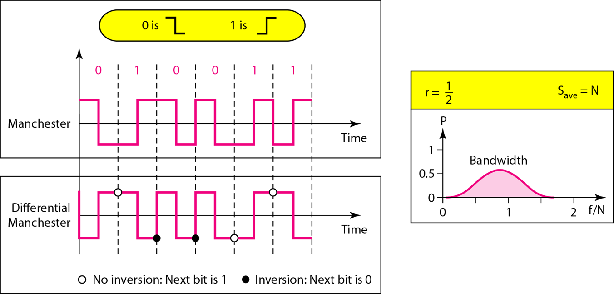  

### AMI & pseudoternary 
- **AMI (Alternate Mark Inversion)**: A 0 is represented by no signal, while 1s alternate between positive and negative voltages.
- **Pseudoternary**: Similar to AMI, but 0s are represented by alternating between positive and negative voltages, while 1s are represented by no signal.
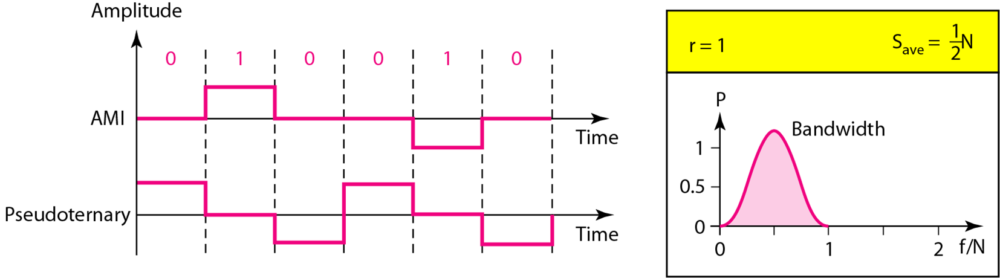

### Multi-level Encoding  

In multi-level encoding, we use the notation `xbXQ` or `B T Q`, where:  
- **Xb** (or **B**) refers to the number of bits encoded per symbol.  

- **XQ** (or **T/Q**) refers to the number of levels used to represent those bits.  

  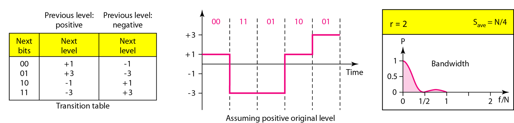

### 4D-PAM5  

4D-PAM5 is a multi-level encoding scheme that uses five voltage levels and represents data in four dimensions, improving transmission speed while maintaining a balance between signal strength and bandwidth efficiency.  

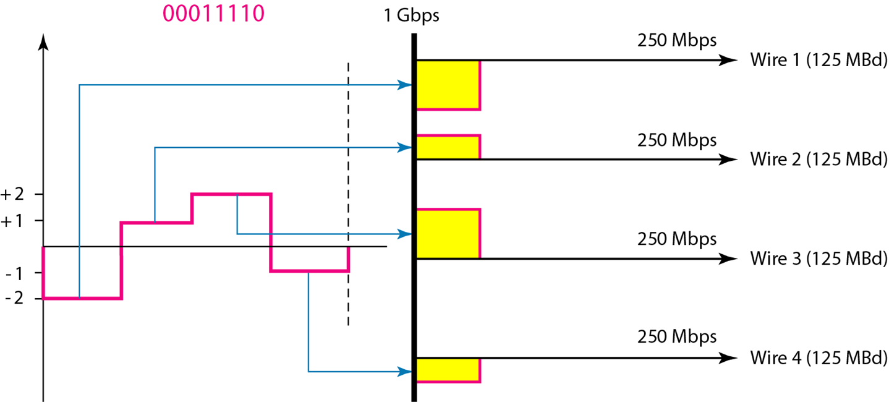  

### MLT-3  

MLT-3 (Multi-Level Transmit-3) encoding reduces the frequency of the signal by alternating among three voltage levels. This technique helps minimize bandwidth usage and avoids long runs of the same signal, improving signal integrity.  

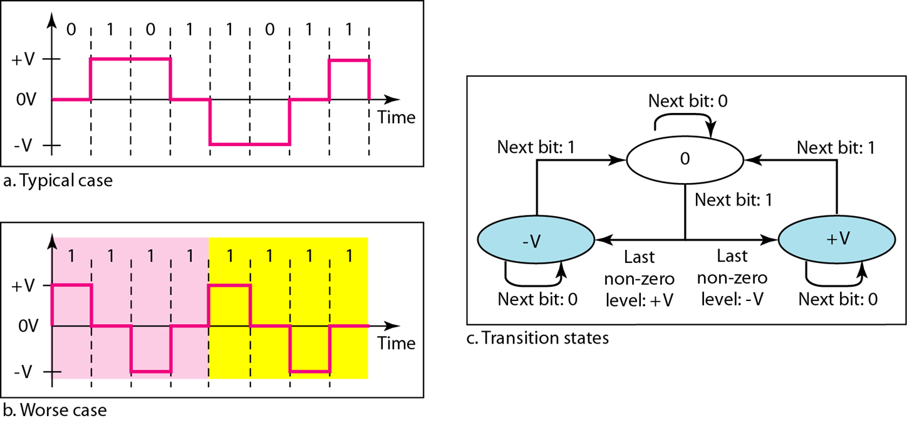

### Line Coding Summary 

| Category         | scheme     | BW average | characteristics                                              |
| ---------------- | ---------- | ---------- | ------------------------------------------------------------ |
| Unipolar         | NRZ        | 2/N        | Costly in power consumption                                  |
| Polar            | NRZ-L      | 2/N        | less power consumption                                       |
| Polar            | NRZ-I      | 2/N        | self-sync for long 1’s and less baseline wandering than NRZ-L |
| Polar            | RZ         | N          | self-sync because of mid-transition and no DC-components     |
| Polar            | Manchester | N          | self-sync because of mid-transition and no DC-components     |
| Bipolar          | AMI        | 2/N        | self-sync for long 1’s and no DC-components                  |
| Multi level      | XbXQ       | N/4        | No self-synch for long same double bits and less DC-components. Possible to detect errors by redundancy |
| Multi level      | 8B6T       | 3N/4       | Self-synchronization and no DC-components. Possible to detect errors by redundancy |
| Multi level      | 4D-PAM5    | N/8        | Self-synchronization and no DC-components. Possible to detect errors by redundancy |
| Multi transition | MLT-3      | N/3        | More complex with self- synchronization for long 1’s and no DC-components. Possible to detect errors by redundancy |

## Block Coding
to lazy to add

## Scrambling
I don't understand 

## Transmission Modes  

- **Parallel**: Multiple bits are transmitted simultaneously over multiple channels or wires, typically used for short-distance communication, such as within a computer or between a computer and a peripheral.  
- **Asynchronous**: In this mode, a start bit (0) is sent at the beginning and one or more stop bits (1s) at the end of each byte, with possible gaps between bytes.  
- **Synchronous**: Bits are transmitted continuously without start or stop bits or gaps. The receiver is responsible for grouping the bits correctly.  
- **Isochronous**: Data is transmitted at consistent intervals, ensuring predictable timing for real-time applications (e.g., audio or video) that require continuous, time-sensitive data streams.  


# Analog Transmission

# Bandwidth Utilization 

# Error Detection and Corretion

# Transmission Media


# Megan fox netwerk

# hamming code


