# Data and Signals

## Digital signals

Digital signals are being represented by multiple analog sine waves


### Bandwith of a dedicated medium 

the Bandwidth of a medium acts like a band-pass filter letting on certain frequencies through. this means that our perfect digital signal that consist of infitante sine waves is now only letting throught the sine wave that are located in the bandwidth/bandpass-filter. 


###  worst case scenario 

in the worst case scenario your medium only lets you send one sine wave without any harmonics. this can be described as: 
```math
\text{Frequency} = \text{Data Rate} / 2
```


## Transmission impairment

### Attenuation (Loss of signal)
When a signal travels through a medium it loses energy overcoming the resistance of the medium
Amplifiers are used to compensate for this loss of energy by amplifying the signal.

### Distortion (Change in signal shape)
Distortion occurs in `composite` signals.
Each frequency component has its own propagation speed  -> don't arrive at the same time so some parts of the signal have a phase shift.

### Noise
- **thermal** : `electrons make noise by moving more heat more moving`
- **Induced** :`From spools (induction) that are active in the system`
- **Crosstalk** : `From signals through wires` 
- **Impulse** : `Voltage spikes in powerplanes (Lightning, power lines)`

## Data Rate

### Nyquist Theorem
Nyquist gives the upper bound for the bit rate of a transmission for a noiseless channel

```math
C = 2*\text{Bandwidth}*\log_2(2n)
```

### Shannon’s Theorem
Shannon’s theorem gives the capacity of a system in the presence of noise.

```math
C = \text{Bandwidth} * \log_2(1 + \text{SNR})
```

## Performance

- **Bandwidth** : `(Frames per minute * frame size)/60`

- **Propagation Delay** : `Distance/Propagation speed`

- **Transmission Delay **: `Message size/bandwidth bps`

- **Latency**: `Propagation delay + Transmission delay + Queueing time + Processing time`

# Digital Transmission

## Digital to Digital Conversion

We can represent digital data by using digital signals. The conversion involves three techniques: `line coding`, `block coding`, and `scrambling`. While `line coding` is always needed the others aren't needed but can be applied

## Line Coding  

Line encoding addresses several key problems:  
- **Baseline wandering**: A voltage offset in the baseline caused by long runs of 0s or 1s.  
- **DC components**: Most mediums are band-pass, so low frequencies (long runs of 0s or 1s) are filtered out.  
- **Self-synchronization**: Misalignment of sender and receiver clocks, leading to errors.  
- **Error detection**: Errors that occur during transmission due to line impairments.  
- **Noise and interference**: Some encoding techniques make the signal more resistant to noise and interference.  
- **Complexity**: More robust and resilient encoding methods are often more complex to implement, impacting baud rate or required bandwidth.  

There are many different line encoding methods, each addressing these problems in unique ways.  
### Unipolar NRZ-L  
This is the encoding we are most familiar with, as it is used in SPI, UART, and I2C.  

  

### Polar NRZ-L & NRZ-I  
NRZ stands for Non-Return-to-Zero.  
- **NRZ-L**: The signal level changes based on the bit value (e.g., 0 = low, 1 = high).  
- **NRZ-I**: The signal inverts when the bit value is 1 and remains unchanged for 0.  

  

### Polar RZ  

RZ stands for Return to Zero

This encoding method ensures that the signal returns to zero between each bit.  

  

### Manchester & Differential Manchester  

Manchester encoding ensures synchronization by encoding data bits based on transitions:  
- **Manchester**: A 0 is represented by a high-to-low transition, and a 1 by a low-to-high transition in the middle of the bit period.  
- **Differential Manchester**: Similar to NRZ-I, it changes transitions only when the data bit is 1. A transition always occurs at the start of the bit period for clock synchronization.

  

### AMI & pseudoternary 
- **AMI (Alternate Mark Inversion)**: A 0 is represented by no signal, while 1s alternate between positive and negative voltages.
- **Pseudoternary**: Similar to AMI, but 0s are represented by alternating between positive and negative voltages, while 1s are represented by no signal.


### Multi-level Encoding  

In multi-level encoding, we use the notation `xbXQ` or `B T Q`, where:  
- **Xb** (or **B**) refers to the number of bits encoded per symbol.  

- **XQ** (or **T/Q**) refers to the number of levels used to represent those bits.  

  

### 4D-PAM5  

4D-PAM5 is a multi-level encoding scheme that uses five voltage levels and represents data in four dimensions, improving transmission speed while maintaining a balance between signal strength and bandwidth efficiency.  

  

### MLT-3  

MLT-3 (Multi-Level Transmit-3) encoding reduces the frequency of the signal by alternating among three voltage levels. This technique helps minimize bandwidth usage and avoids long runs of the same signal, improving signal integrity.  


### Line Coding Summary 

| Category         | scheme     | BW average | characteristics                                              |
| ---------------- | ---------- | ---------- | ------------------------------------------------------------ |
| Unipolar         | NRZ        | 2/N        | Costly in power consumption                                  |
| Polar            | NRZ-L      | 2/N        | less power consumption                                       |
| Polar            | NRZ-I      | 2/N        | self-sync for long 1’s and less baseline wandering than NRZ-L |
| Polar            | RZ         | N          | self-sync because of mid-transition and no DC-components     |
| Polar            | Manchester | N          | self-sync because of mid-transition and no DC-components     |
| Bipolar          | AMI        | 2/N        | self-sync for long 1’s and no DC-components                  |
| Multi level      | XbXQ       | N/4        | No self-synch for long same double bits and less DC-components. Possible to detect errors by redundancy |
| Multi level      | 8B6T       | 3N/4       | Self-synchronization and no DC-components. Possible to detect errors by redundancy |
| Multi level      | 4D-PAM5    | N/8        | Self-synchronization and no DC-components. Possible to detect errors by redundancy |
| Multi transition | MLT-3      | N/3        | More complex with self- synchronization for long 1’s and no DC-components. Possible to detect errors by redundancy |

## Block Coding  

Block coding takes smaller chunks of bits (blocks) and interprets them into larger blocks to introduce redundancy. This redundancy helps with error detection and correction.  

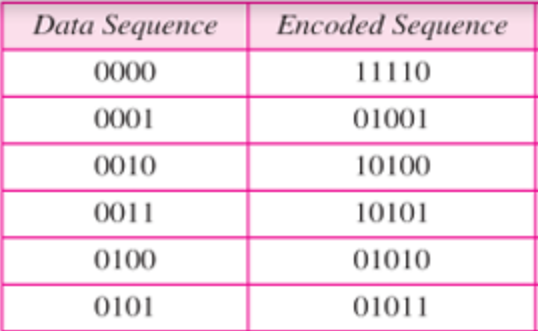  

## Scrambling  

Scrambling modifies problematic bit patterns (e.g., those causing DC components, baseline wandering, or self-synchronization issues) into predetermined patterns that are easier to transmit and decode. For example, `0000` might be scrambled into `1010`. The receiver uses the same pattern to unscramble the data during decoding.  


## Transmission Modes  

- **Parallel**: Multiple bits are transmitted simultaneously over multiple channels or wires, typically used for short-distance communication, such as within a computer or between a computer and a peripheral.  
- **Asynchronous**: In this mode, a start bit (0) is sent at the beginning and one or more stop bits (1s) at the end of each byte, with possible gaps between bytes.  
- **Synchronous**: Bits are transmitted continuously without start or stop bits or gaps. The receiver is responsible for grouping the bits correctly.  
- **Isochronous**: Data is transmitted at consistent intervals, ensuring predictable timing for real-time applications (e.g., audio or video) that require continuous, time-sensitive data streams.

# Analog Transmission

## Digital-to-Analog Conversion  

Digital-to-analog conversion involves modifying one of the characteristics of an analog signal based on digital data. A carrier signal (frequency \( f_c \)) serves as the medium to transport digital information in an analog waveform.  

### Amplitude Shift Keying (ASK)  

ASK alters the amplitude of a carrier signal to represent digital data. Different amplitude levels correspond to binary 0s and 1s.  

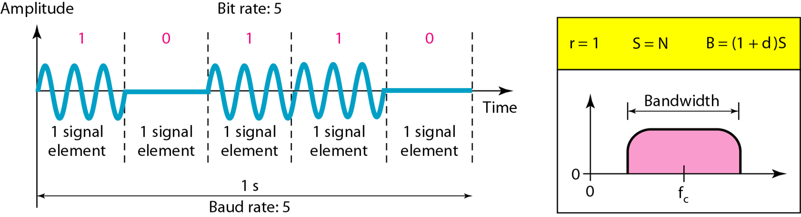  

### Frequency Shift Keying (FSK)  

FSK changes the frequency of a carrier signal based on the digital data stream:  
- A "1" is represented by \( f_1 = f_c + \Delta f \).  
- A "0" is represented by \( f_2 = f_c - \Delta f \).  

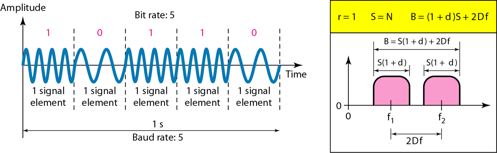  

### Phase Shift Keying (PSK)  

PSK modifies the phase of the carrier signal to represent digital data. It is more reliable than ASK, as it is less affected by noise, which primarily alters signal amplitude.  

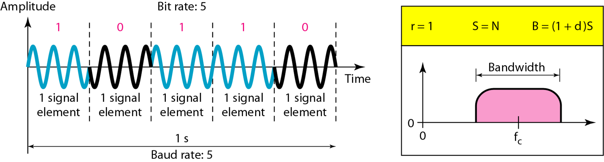  

### Quadrature Phase Shift Keying (QPSK)  

QPSK enhances PSK by encoding two bits per symbol. The bit stream is split into pairs, each modulating a carrier frequency. One carrier is phase-shifted by 90° (in quadrature) relative to the other, enabling higher data rates while maintaining robustness.  

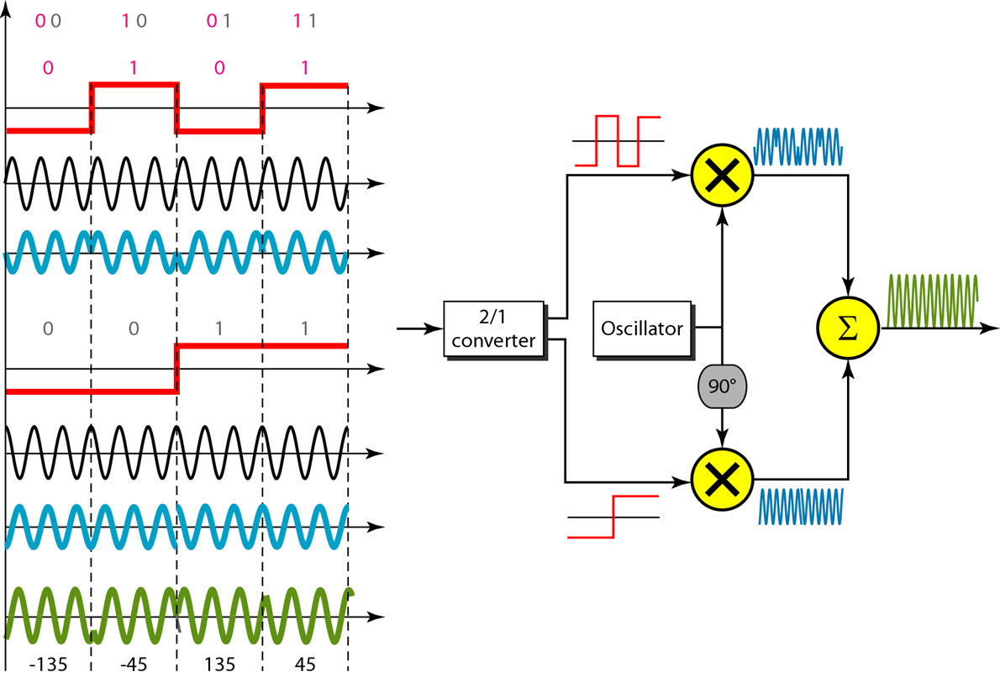 

### Concept of a Constellation Diagram  

A constellation diagram is used to visualize digital modulation schemes.  
- The **X-axis** represents the in-phase carrier component.  
- The **Y-axis** represents the quadrature carrier component.  
Each point on the diagram corresponds to a specific symbol in the modulation scheme.  

  

## Analog-to-Analog Conversion  

Analog-to-analog conversion involves modifying a continuous analog signal to carry information. It uses similar concepts as digital-to-analog conversion but applies them to continuous signals.  

- **Amplitude Modulation (AM)**: The amplitude of the carrier wave is varied in proportion to the information signal.  
- **Frequency Modulation (FM)**: The frequency of the carrier wave is varied based on the information signal.  
- **Phase Modulation (PM)**: The phase of the carrier wave is altered to convey the information signal.  

# Bandwidth Utilization 

## Multiplexing

### Frequency Division Multiplexing (FDM)  

FDM divides the available bandwidth into multiple frequency bands, with each band assigned to a different signal. This allows simultaneous transmission without interference.  

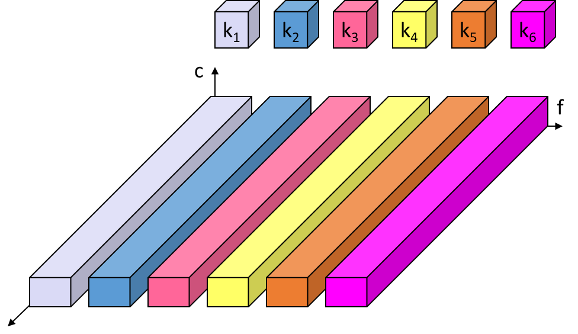  

### Wavelength Division Multiplexing (WDM)  

WDM is similar to FDM but is used specifically in optical fiber communication. It combines multiple light wavelengths (colors) into a single fiber, with each wavelength carrying separate data streams.  
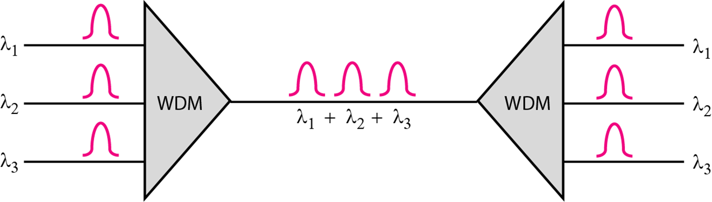  

### Time Division Multiplexing (TDM)  

TDM divides the available bandwidth into time slots, with each slot assigned to a different signal. Signals are transmitted one after another in a repeating cycle.  

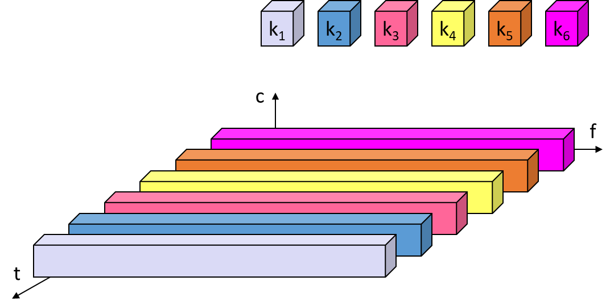  

### Hybrid TDM/FDM  

Hybrid TDM/FDM combines the principles of both techniques. FDM is used to divide the bandwidth into frequency bands, and TDM is applied within each band to share time slots among multiple signals.  

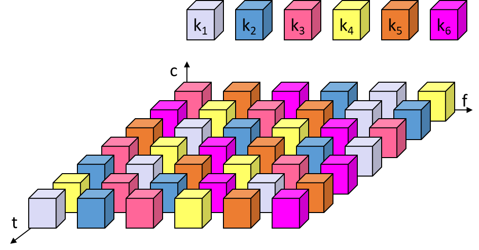  

### Code Division Multiplexing (CDM)  

CDM allows multiple signals to share the same frequency spectrum by assigning a unique code to each signal. These codes ensure that signals can be separated and decoded correctly at the receiver.  

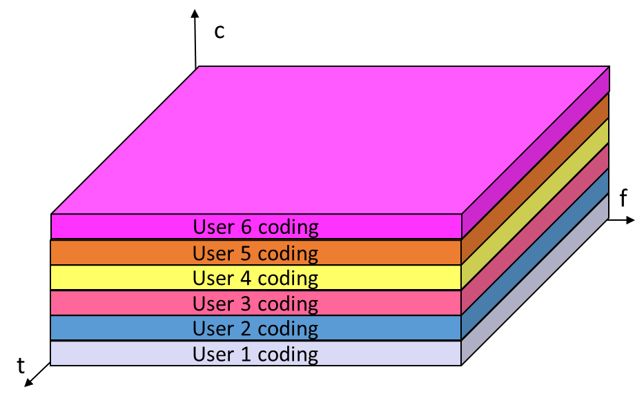  

## Spread Spectrum

### Direct Sequence Spread Spectrum (DSSS)

### Frequency hopping spread spectrum (FHSS)

# Error Detection and Corretion

## Block coding
### Codewords  

Codewords are carefully chosen so that each is distinct and separated by a minimum distance. If a bit flip occurs, the mesage will not match any valid codeword, allowing the receiver to detect the error and discard the message.

### Parity check

Parity checks are a simple error detection mechanism:  
- **One-Dimensional Parity Check**: A single parity bit is added to each block to ensure the total number of 1s is even (even parity) or odd (odd parity).  

- **Two-Dimensional Parity Check**: Parity bits are added for both rows and columns of a data matrix, allowing for detection of more complex errors.  

  

### Hamming code 

The **Hamming Code** is a type of error-correcting code that can detect and correct single-bit errors. The **First-Order Hamming Code** is the simplest form of Hamming code, using redundant parity bits placed strategically within the data.

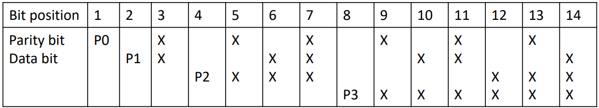

## Cyclic Codes
### Cyclic Redundancy Check (CRC)

### Checksum

A checksum is a method used to verify the integrity of transmitted data. To calculate it, you start by adding up all the data, such as `17, 02, 11, 07, 03`. Convert the values into binary and split them according to the size of your checksum. For example, with a 4-bit checksum, you would represent `40` as `0010 1000`. Then, add the two 4-bit chunks together, which gives `1010` (decimal 10), known as the wrapped checksum. Next, invert the bits, resulting in `0101` (decimal 5), and append this value to the original data, forming the message `17, 02, 11, 07, 03, 05`. On the receiving side, you repeat the same process. If the checksum results in `0` at the end of the calculation, the transmission is considered error-free.

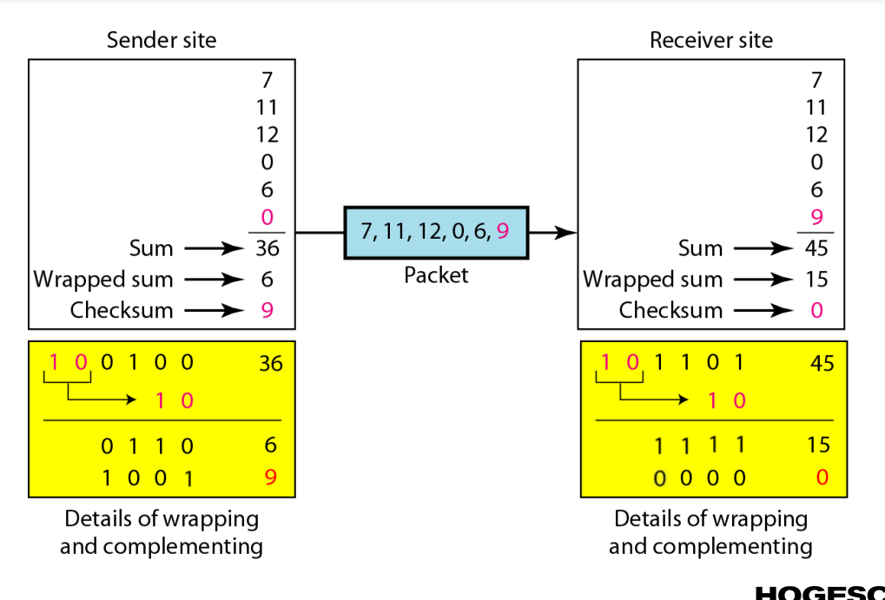


# Transmission Media

## Guided Media

### Twisted Pairs Cable

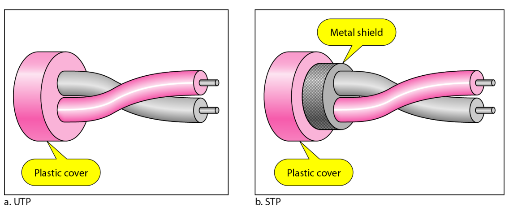

### Coaxial  Cable

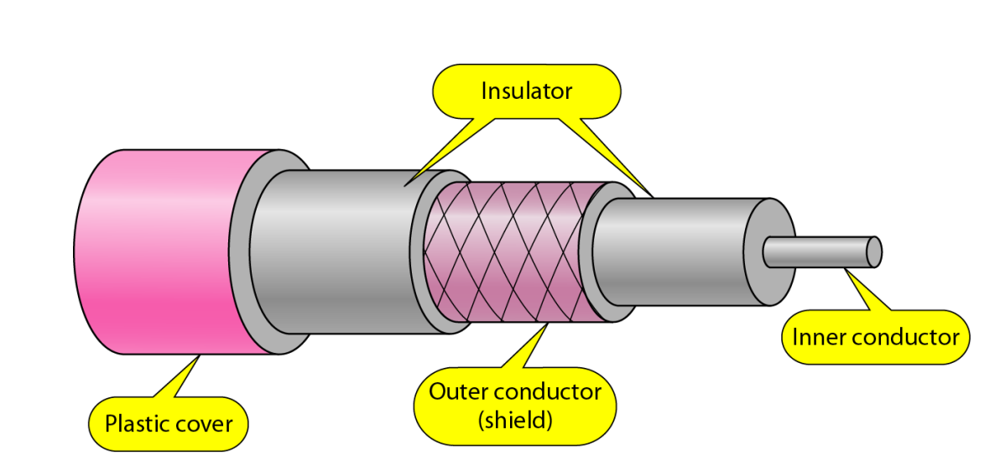

### Fiber Optics

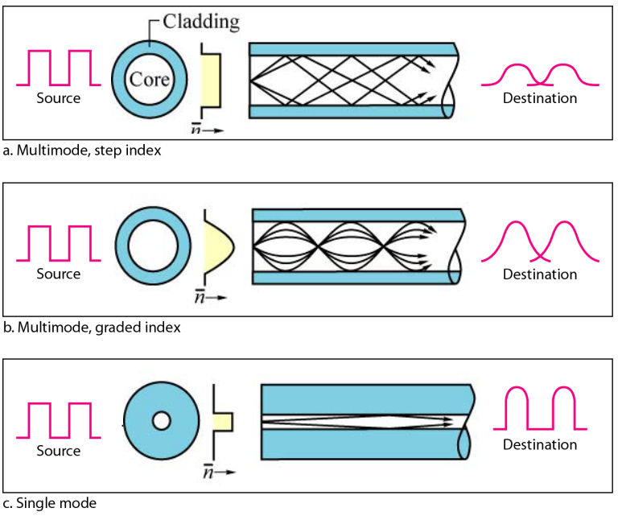

## Unguided Media

### Ground Propagation (  x < 2 MHz )  

In ground propagation, signals travel along the curvature of the Earth. Signal loss occurs due to scattering around obstacles.  

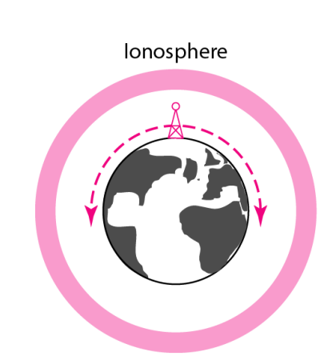  

### Sky Propagation ( 2 MHz < x < 30 MHz )  

Sky propagation involves signals traveling through the air and reflecting off the ionosphere's surface. This enables long-distance communication by "bouncing" signals between the Earth and the ionosphere.  

  

### Line-of-Sight Propagation ( 30 MHz < x )  

In line-of-sight propagation, signals travel directly through the air, with the transmitting antenna aimed at the receiving antenna in clear line-of-sight.  

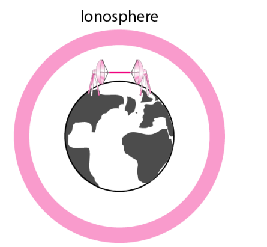  

The Fresnel Zone defines the area around the line of sight where signal energy is concentrated.  
- **Partially Obscured Fresnel Zone**: Leads to reduced signal quality.  
- **Fully Obscured Fresnel Zone**: Results in no signal reception.  

# Megan fox netwerk

**PSTN (Public Switched Telephone Network)**: A traditional circuit-switched telephone network for voice communication.

**GMSC (Gateway Mobile Switching Center)**: A central component in GSM networks responsible for routing calls to the correct MSC or forwarding to the external network.

**HLR (Home Location Register)**: A database containing details of every subscriber registered in the GSM network, such as their service profile, location information, and activity status.

**VLR (Visitor Location Register)**: A database that temporarily stores information about subscribers who are currently roaming in the area controlled by the MSC.

**MSRN (Mobile Station Roaming Number)**: A temporary number assigned to a mobile subscriber for routing calls while they are roaming.

**MSC (Mobile Switching Center)**: The primary service delivery node in the GSM network, responsible for routing voice calls, SMS, and other services.

**BSS (Base Station Subsystem)**: A section of the GSM network responsible for communication between the mobile station (MS) and the MSC. It consists of BTS and BSC.

**BTS (Base Transceiver Station)**: The equipment facilitating wireless communication between the network and mobile devices.

**BSC (Base Station Controller)**: A component managing the BTSs in its area, handling tasks like handovers and radio resource management.

**MS (Mobile Station)**: The subscriber's mobile device, consisting of the hardware and SIM card.

**LA (Location Area)**: A region within a GSM network where mobile stations can move around without needing location updates sent to the HLR/VLR.

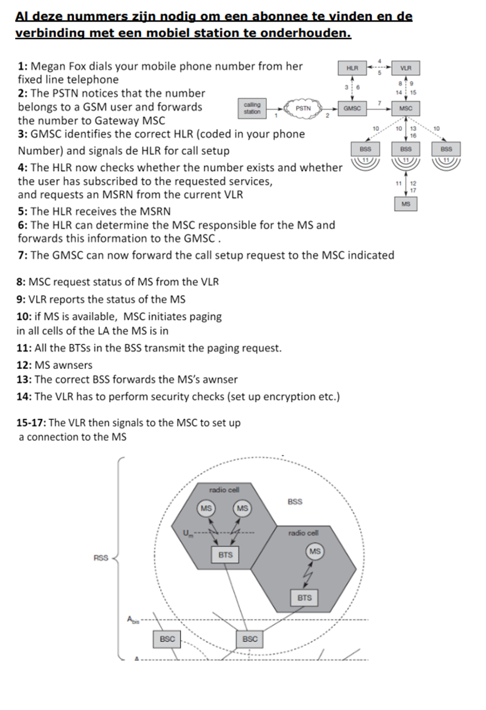